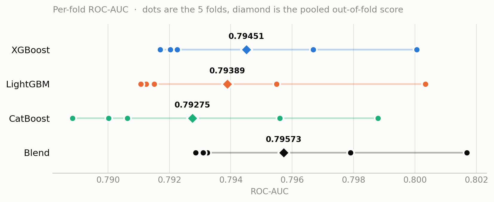

<!-- BANNER: drop the image at figures/banner.png (or change the path below).
     Recommended ~1280x320 so it doesn't dominate the page on GitHub. -->


# Home Credit Default Risk — Gradient Boosting Ensemble

Predicting loan default from an applicant's application form plus their prior credit history,
for the [Home Credit Default Risk](https://www.kaggle.com/competitions/home-credit-default-risk)
Kaggle competition.

**Private leaderboard: 0.79566 ROC-AUC** — a rank-averaged blend of XGBoost, LightGBM and
CatBoost over 666 engineered features.

---

## Result

| Model | OOF ROC-AUC | OOF PR-AUC | Private LB |
|---|---|---|---|
| XGBoost (Optuna-tuned) | 0.79451 | 0.29209 | 0.79440 |
| LightGBM | 0.79389 | 0.28992 | — |
| CatBoost | 0.79275 | 0.28871 | — |
| **Rank-average blend** | **0.79573** | **0.29382** | **0.79566** |

Baseline for context: the no-skill PR-AUC is 0.0807, the dataset's positive rate. The
competition's winning private score was approximately 0.806.

### Cross-validation predicted the leaderboard to within 0.0001

| | OOF | Private LB | gap |
|---|---|---|---|
| XGBoost alone | 0.79451 | 0.79440 | −0.00011 |
| Blend | 0.79573 | 0.79566 | −0.00007 |
| **Blend gain** | **+0.00122** | **+0.00126** | +0.00004 |

This is the number I'd point to first. Every model here early-stops on the same fold it is
scored on, which biases out-of-fold estimates upward, so the OOF figure had to be treated as
optimistic by an unknown amount until a held-out score existed. It turns out to be worth about
0.0001 — because the AUC-versus-iteration curve is very flat near its optimum at
`learning_rate=0.02` with 200-round patience over several thousand trees, so selecting the peak
buys almost nothing over selecting near it.

The blend's advantage transferred intact as well (+0.00126 held out against +0.00122 in
cross-validation), confirming it is real model diversity rather than an artifact of scoring on
the folds the models were stopped on.

---

## Data

Seven tables, one row per applicant in the main file and many rows per applicant in the rest:

| Table | Grain |
|---|---|
| `application_train` / `application_test` | one row per loan application — the target lives here |
| `bureau` | loans at other institutions, reported to the credit bureau |
| `bureau_balance` | monthly status history for each bureau loan |
| `previous_application` | prior applications to Home Credit |
| `POS_CASH_balance` | monthly balance of prior point-of-sale / cash loans |
| `installments_payments` | one row per installment due and paid |
| `credit_card_balance` | monthly credit card balances |

307,511 training rows, 48,744 test rows, **8.07% positive rate** (24,825 defaults).

---

## Pipeline

```
7 raw CSVs
   │
   ├─ per-table feature functions          one-hot the categoricals, then aggregate
   │  (bureau, previous_application,       to SK_ID_CURR with mean/max/min/sum/var
   │   pos_cash, installments,             and hand-built ratios
   │   credit_card)
   │
   ├─ LEFT JOIN onto application           no history → NaN, which the boosters
   │                                       route as missing rather than imputing
   │
   ├─ 666 features                         train and test stacked while categorical
   │                                       dtypes are assigned, so both sides share
   │                                       one category list
   │
   ├─ 5-fold StratifiedKFold (seed 42)     ONE fold list, reused by all three models
   │     ├─ XGBoost   (GPU hist)
   │     ├─ LightGBM  (CPU)
   │     └─ CatBoost  (GPU)
   │
   └─ rank-average blend                   equal weights
```

### Feature engineering

Every child table is one-hot encoded, then aggregated to `SK_ID_CURR` — the join key — with
`mean`, `max`, `min`, `sum` and `var` over its numeric columns, plus hand-built ratios
(payment-to-income, credit-to-goods, days-employed-to-age, installment shortfall and lateness).
Division is guarded by a `safe_div` helper, and any infinity surviving an overflow in `var` or
`sum` is replaced with NaN afterwards.

Missing values are **never imputed**. A gap here is usually informative — an applicant with no
bureau record genuinely has no credit history — and all three libraries learn a default split
direction for missing values, which recovers more signal than a median fill would.

Categoricals are handled natively rather than label-encoded: pandas `category` dtype for
XGBoost and LightGBM, integer codes with an explicit `cat_features` list for CatBoost, which
rejects `category` columns and NaN inside categorical features outright.

### Validation design

All three models consume one shared `FOLDS = list(StratifiedKFold(5, shuffle=True,
random_state=42).split(X, y))`. Materialising the split list once, rather than re-seeding per
model, makes it structurally impossible for the three out-of-fold vectors to fall out of
row alignment — which would silently corrupt the blend rather than raise.



Fold-level AUCs, showing why single-fold comparisons are not informative here:

| Fold | 0 | 1 | 2 | 3 | 4 | spread |
|---|---|---|---|---|---|---|
| LightGBM | 0.79125 | 0.80034 | 0.79150 | 0.79549 | 0.79107 | 0.0093 |
| CatBoost | 0.79063 | 0.79880 | 0.78884 | 0.79560 | 0.79002 | 0.0100 |

Fold 1 is the easiest and fold 2 the hardest **for both model families independently**, so the
spread is a property of the data split, not of model variance. The plot makes the consequence
plain: each model's five fold scores span ~0.010, which is **5.7× the 0.0018 gap between the
best and worst model** (the diamonds). Any comparison made on a single fold would be noise, and
the pooled out-of-fold score is the only one worth reading.

Regenerate the figure with `python make_figures.py`. It reads `outputs/oof_all_models.csv` and
nothing else — the fold assignment is recoverable because `StratifiedKFold.split(X, y)` consumes
only `y` and the seed, so the exact five folds can be rebuilt without the feature matrix. The
script asserts its reconstructed LightGBM and CatBoost fold scores match the values printed
during training before it plots anything.

---

## Models

Parameters were chosen to be comparable across libraries, so that differences come from each
algorithm's inductive bias rather than from mismatched regularisation.

| | XGBoost | LightGBM | CatBoost |
|---|---|---|---|
| tree growth | depth-wise, `max_depth=6` | leaf-wise, `num_leaves=40` | oblivious (symmetric), `depth=6` |
| learning rate | 0.02 | 0.02 | 0.02 |
| L2 | `reg_lambda=5.0` | `reg_lambda=5.0` | `l2_leaf_reg=5.0` |
| row sampling | `subsample=0.85` | `subsample=0.85`, `subsample_freq=1` | `Bernoulli`, `subsample=0.85` |
| column sampling | `colsample_bytree=0.5` | `colsample_bytree=0.5` | not set on GPU (see below) |
| early stopping | 200 rounds on AUC | 200 rounds on AUC | 200 rounds on AUC |
| device | GPU (L4) | CPU | GPU (L4) |
| time / fold | ~44 s | ~200–310 s | ~210–290 s |

Three library-specific traps worth recording:

- **LightGBM ignores `subsample` unless `subsample_freq >= 1`.** Silently — every tree sees all
  rows and you lose the row-sampling diversity that is half the point of blending.
- **CatBoost rejects `rsm` (column sampling) on GPU** for non-pairwise loss functions, so the
  CatBoost trees are column-correlated in a way the other two are not. Accepted rather than
  dropping to CPU.
- **LightGBM has no GPU support in the PyPI wheel.** Both GPU backends (`device_type='gpu'` via
  OpenCL, `device_type='cuda'`) are compile-time options, so running on GPU means building from
  source. Not worth it here — the full CPU run is ~22 minutes.

XGBoost's parameters come from a 60-trial Optuna study (TPE sampler, SQLite-backed, in
`outputs/optuna.db`) on a holdout seeded differently from the CV folds. Tuning was worth
+0.00134 over the hand-set baseline (0.79317 → 0.79451). LightGBM and CatBoost were not tuned.

---

## Blending

Rank-averaging, not probability-averaging:

```python
blend = sum(rankdata(p) / len(p) for p in preds) / len(preds)
```

ROC-AUC depends only on the ordering of predictions, and the three models are calibrated
differently — CatBoost's ordered boosting in particular shifts the scale — so averaging raw
probabilities would let whichever model is most confident dominate for no good reason.

Spearman correlation between the out-of-fold rankings:

|  | xgb | lgb | cat |
|---|---|---|---|
| **xgb** | 1.0000 | 0.9784 | 0.9738 |
| **lgb** | 0.9784 | 1.0000 | 0.9665 |
| **cat** | 0.9738 | 0.9665 | 1.0000 |

This matrix is what makes the blend work. At 0.99+ the models would be interchangeable and
averaging would return a rounding error; at 0.9665 for the LightGBM/CatBoost pair there is real
disagreement to cancel. Note that the two *weaker* models are the most different from each
other, which is why dropping CatBoost for being last would have been a mistake.

**Equal weights were used deliberately.** A simplex grid search over the weights found
0.40/0.35/0.25 for +0.00003 — sixteen times below the threshold at which the gain would be
distinguishable from noise, and fitted on the same out-of-fold predictions used to score it.
Equal weights avoid the only step in this pipeline that could overfit the validation set, and
the leaderboard gap above confirms nothing was left on the table.

The blend improved PR-AUC proportionally more than ROC-AUC (+0.59% relative against +0.15%),
meaning it sharpened the top of the ranking — the region a lending decision actually operates
in — rather than trading it away for middle-of-the-distribution ordering.

---

## Design decisions

**No class weighting, no SMOTE, no undersampling** despite the 8% positive rate. Setting
`scale_pos_weight = w` changes the minimiser of the loss to `q = w·p / (w·p + (1−p))`, which is
a *monotone* transform of the true probability `p`. ROC-AUC and PR-AUC are both functions of the
ranking alone, so a monotone transform cannot change either — reweighting is close to a no-op
for the metric while destroying calibration, which is the one output with direct business value
(expected loss is `P(default) × exposure`, and that cannot be computed from a rank). If
asymmetric costs matter, the right move is to keep the model calibrated and set the threshold
at `C_FP / (C_FP + C_FN)`, which is free, reversible, and doesn't require retraining when costs
change.

The calibration check in the notebook — mean predicted probability 0.0807 against an actual
rate of 0.0807 — only means anything because no reweighting was applied.

**ROC-AUC for model selection, PR-AUC reported alongside.** ROC-AUC is the competition metric,
which settles it, but it is also the imbalance-*invariant* one: TPR and FPR are both
within-class rates, so the ROC curve is unchanged by the class ratio, whereas precision mixes
the classes and average precision moves with prevalence. The legitimate criticism of ROC-AUC
under imbalance is about sensitivity rather than bias — at 1:11 here, a false positive moves
FPR by 1/282,700 — so PR-AUC is tracked in parallel to catch damage at the top of the ranking
that ROC would average away. Early stopping runs on AUC regardless, because average precision
is dominated by the sparse top of the ranking and is too noisy a stopping signal over thousands
of iterations.

**Test predictions average to 0.071, below the 0.0807 training rate.** All three models agree to
within 0.001 on this, so it reflects the test set scoring slightly lower-risk rather than an
incomplete fold accumulation.

---

## Reproducing

### Requirements

Built on Google Colab with an L4 GPU. Python 3.13, `xgboost` 3.4.1, `pandas` 2.2.3, plus
`lightgbm`, `catboost`, `optuna`, `wandb`, `shap`, `pyarrow`.

```bash
pip install xgboost lightgbm catboost pandas pyarrow scikit-learn optuna wandb shap
```

### Running

Open `Homcredit_XG_Cat_LGM.ipynb` in Colab, select a GPU runtime, and run top to bottom. The
data-fetch cell downloads the competition archive using a Kaggle API key — set `KAGGLE_KEY` as a
Colab secret and accept the competition rules first, or the download returns `403`. Nothing else
needs configuring; `W&B` logging is behind a `log_wandb` flag.

Full run from cold: roughly 10 minutes of feature engineering, then ~4 minutes (XGBoost),
~22 minutes (LightGBM, CPU) and ~21 minutes (CatBoost) for the three 5-fold loops.

Feature engineering caches to `train_features.parquet` / `test_features.parquet`, so re-running
only the modelling cells skips it. Those parquets are gitignored — see below.

### Verifying the reported numbers without re-running anything

`outputs/oof_all_models.csv` carries `SK_ID_CURR`, `TARGET` and each model's out-of-fold
prediction, so every figure in this README is checkable in a few lines and without downloading
the 3.2 GB dataset:

```python
import pandas as pd
from sklearn.metrics import roc_auc_score, average_precision_score

df = pd.read_csv('outputs/oof_all_models.csv')
for c in ['oof_xgb', 'oof_lgb', 'oof_cat', 'oof_blend']:
    print(f"{c:10s} AUC {roc_auc_score(df.TARGET, df[c]):.5f} "
          f"AP {average_precision_score(df.TARGET, df[c]):.5f}")
```

---

## Repository layout

```
├── Homcredit_XG_Cat_LGM.ipynb    full pipeline: features → 3 models → blend
├── Homcredit.ipynb               earlier XGBoost-only version, kept for history
├── make_figures.py               regenerates figures/ from outputs/oof_all_models.csv
├── README.md
├── .gitignore
├── figures/
│   └── fold_spread.png
└── outputs/
    ├── oof_all_models.csv        per-row OOF predictions for all 3 models + blend
    ├── feature_importance_gain.csv   mean gain per feature, averaged over folds
    ├── optuna.db                 the 60-trial tuning study (SQLite)
    ├── submission_blend.csv      the 0.79566 submission
    ├── submission_xgb.csv        the 0.79440 control submission
    └── preds/
        ├── oof_{xgb,lgb,cat}.npy     out-of-fold vectors, row-aligned to train
        └── test_{xgb,lgb,cat}.npy    fold-averaged test predictions
```

**Not committed** (see `.gitignore`): the raw Kaggle CSVs (3.2 GB), the engineered-feature
parquets (248 MB, one of them over GitHub's 100 MB file limit), and the 15 trained fold models
plus the joblib bundle (164 MB). All are regenerated by re-running the notebook. The `preds/`
`.npy` vectors are committed instead — they are the actual experimental result, at 2.4 MB each.

---

## Known limitations

- **Early stopping selects the tree count on the fold being scored**, inflating the OOF estimate.
  Measured at ~0.0001 against the leaderboard, so it is documented rather than fixed; an inner
  validation split would remove it at the cost of a fold's worth of training data.
- **Optuna's tuning split overlaps the CV folds.** A different seed (1234) was used for the
  tuning holdout, but it draws from the same rows the folds are built from, so tuned XGBoost
  parameters have seen every CV validation row at least once.
- **LightGBM and CatBoost are untuned**, carrying hand-set parameters mirrored from XGBoost.
  Tuning them would likely close some of the 0.0018 gap to XGBoost, and might reduce blend gain
  by making the three models more alike.
- **Model diversity is close to exhausted.** At 0.966–0.978 rank correlation, a fourth
  gradient-boosted tree model would add very little; further gains need new features or a
  genuinely different model class.
